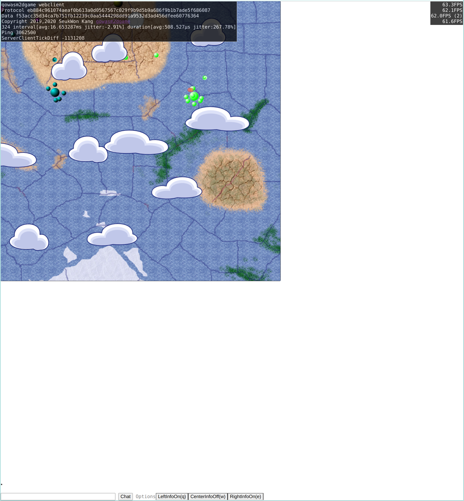
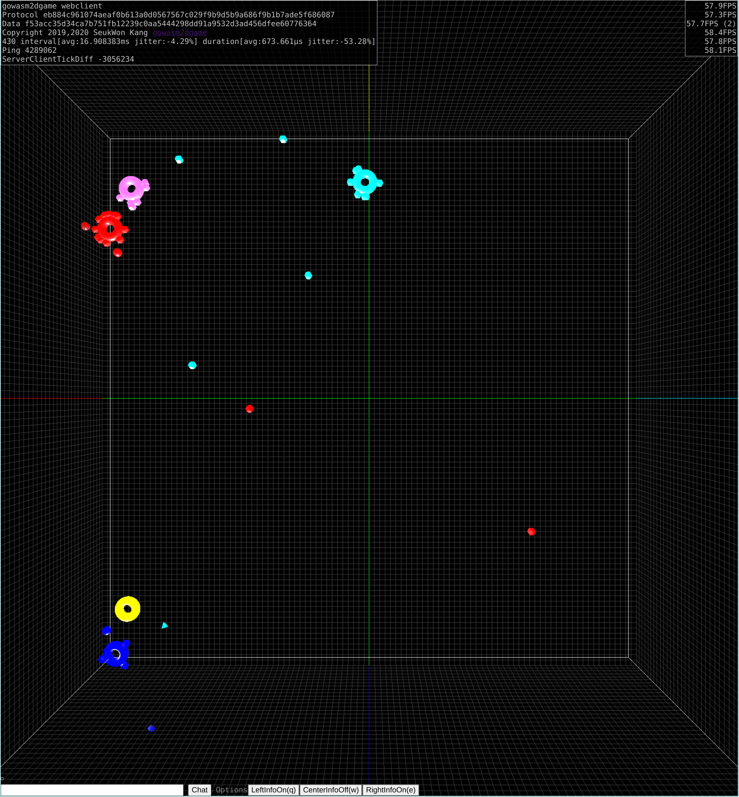

# html canvas 와 webgl 버전의 클라이언트를 지원하는 2d 게임 프레임웍

html canvas version 

webgl version

# 사전 준비 사항 ( goguelike 의 INSTALL.md 참고)

준비물 : linux(debian,ubuntu,mint) , chrome web brower , golang 

goimports : 소스 코드 정리, import 해결

    go get golang.org/x/tools/cmd/goimports

버전 string 생성시 사용 : windows, linux 간에 같은 string생성

    go get github.com/kasworld/makesha256sum

프로토콜 생성기 : https://github.com/kasworld/genprotocol

    go get github.com/kasworld/genprotocol

Enum 생성기 : https://github.com/kasworld/genenum

    go get github.com/kasworld/genenum

Log 패키지 및 커스텀 로그레벨 로거 생성기 : https://github.com/kasworld/log

    go get github.com/kasworld/log
    install.sh 실행해서 genlog 생성 

# 개요 

python 2.x 와 wxpython tcp connection 으로 만들었던 wxgame2 를 

golang, websocket, wasm 으로 포팅하는 프로젝트 입니다. 

python2가 지원이 종료된다니 겸사 겸사 이기도 합니다. (python3로 포팅할 계획은 없습니다.)

goguelike를 만들면서 정리한 go언어 서버 제작 용 라이브러리(프레임웍) 의 총정리 예제이기도 합니다.

중요한 역할을 하는 것들을 정리해보면

[genprotocol](https://github.com/kasworld/genprotocol) 서버 클라이언트가 사용할 프로토콜 생성, 관리 

[argdefault](https://github.com/kasworld/argdefault) : config와 command line arguments 

[prettystring](https://github.com/kasworld/prettystring) : struct 의 string 화 / admin web , debug용 

[genenum](https://github.com/kasworld/genenum) : enum 의 생성, 관리 

[log](https://github.com/kasworld/log) : 전용 log package의 생성, 사용 

[signalhandle](https://github.com/kasworld/signalhandle) : signal을 관리해서 프로그램의 linux 서비스화, start,stop,forcestart,logreopen

    windows에서 동작 시키려면 이 signalhandle을 signalhandlewin 으로 교체한 serverwin 을 사용합니다.  

정도 입니다. 

패킷의 marshaler로는 json을 썼었는데 너무 느리고 커져서  gob로 바꿨습니다. 

서버 기반으로 작동하기에 모든 로직 처리는 서버에서 이루어 지며 
웹 클라이이언트는 뷰어 로만 작동합니다. ( 서버 패킷 간 화면 표시의 위치 보정 정도 )

AI 는 현재는 서버 내부에서 작동하지만 
AI와 게임 스테이지 간은 스테이지 정보를 보내주고 AI는 동작 command를 만들어 돌려주는 형태로 분리 되어 있습니다. 

AI의 동작은 시간 기반으로 제한을 받으며 이를 위반하는 command 는 무시 됩니다. 

예를 들어 기본 총알인 bullet은 2초에 한번 발사 할 수 있습니다. ( 또는 10초간 모았다가 연속으로 5번 발사 할 수도 있습니다. )
같은 식입니다. 

stage는 6개의 AI(client) 가 모여서 게임을 하는 방 의 개념이며 아직 까지는 여러 stage를 지원 하지는 않고 있습니다. 
여러 stage를 지원하려면 stage manager나 로비 , 방의 생성, 참가 , 퇴장 등의 기능을 지원 해야 하는데 
wxgame2 의 go언어 포팅 이라는 원래 목적을 넘어 서는 것 같기 때문입니다. 

(하지만 언젠가 하게 될지도 모릅니다. )

## 서버 실행후 브라우저 서비스 포트 (config에서 수정 가능)

    open admin web
    http://localhost:24201/
    open client web
    http://localhost:24101/
    open glclient web
    http://localhost:24101/gl.html

# windows 에서 작동시키려면?

signalhandlewin을 사용하는 rundriver/serverwin.go 를 사용하시면 됩니다. 
